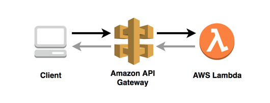
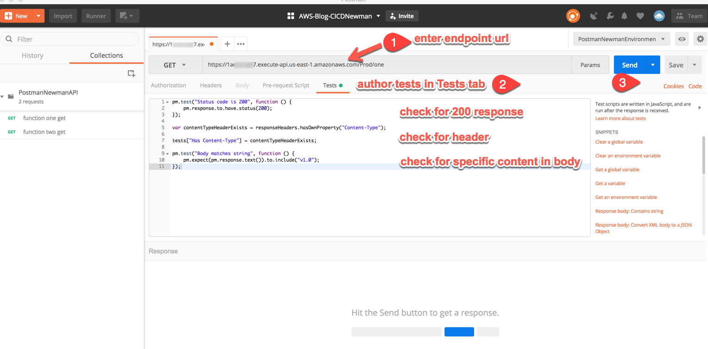
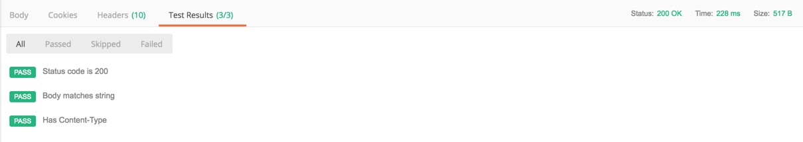
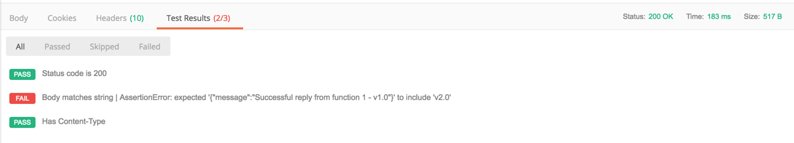

I am sure by now most readers recognize the value of API driven development. API driven development espouses the virtues of modularity, separation of concern and abstracting complexity, which make API's easier to test, reuse and reason about their role in your architecture. Given these virtues, it is easy to understand why API's are so ubiquitous. I won't go further into the merits of API driven development and instead shift focus to the importance of testing your APIs not only for performance but also for functionality. More specifically, the importance of efficiently automating the testing and feedback
process and how you can accomplish that using API testing tools and AWS services.

In this post, we will highlight how to automate the testing and reporting of test results using Postman along with AWS services such as AWS Code Pipeline, Lambda, Amazon Athena, and Amazon QuickSight. 

Let's start with a simple API containing an endpoint that we need to make sure returns a 200 response code along with specific content in the body and a particular header as part of that response. This simple API would look something like the following where we use Amazon API Gateway to create our API and Lambda to implement the logic that determines the response. 

As a tester of that API, you would code your test script in Postman and make a call to that API to have the response evaluated by the test script. In Postman one can write and run tests for each request using JavaScript. Here is what that looks like for a simple API.

When we press Send, we ask Postman to send a request to that particular endpoint. If we have a test script in the Test section, we expect Postman to evaluate the response according to our script logic. As stated earlier we are looking for three elements in the response: a specific header, a 200 response,
and specific content in the body. If we get all elements back, we pass all three tests.

If any of our tests fail Postman will let us know. In this case we changed our test script to look for something in the body we know will not be returned.

As you can see  Postman is a great tool for testing your API's, but how can we include this testing as part of an automated pipeline?  

Postman has a complementary project called Newman which is a command line collection runner that allows you to execute the same tests via the command line.  Moreover, Newman is built as a Node.js library enabling execution from within your Node.js code. We will take advantage of this feature to automate tests by wrapping our test execution in a Lambda function that runs our test script inside AWS CodePipeline. 

As a developer you would code your APIs, create your test script using Postman, export your Postman test script to S3 bucket, and execute your CodePipline. CodePipeline includes a stage that uses Lambda to execute your test script. Your lambda function knows what tests to execute and results to expect by reading the Postman files (exported from Postman) in S3.

This is what the architecture looks like.

When the Testing stage completes the lambda function saves results in an S3 bucket in the form of JSON files. At this point you can use Athena to perform queries agains the test results to find out how many tests were executed, how many passed, etc. Furthermore, you can use quicksight to visualize test results. 

TODO: screen shots.
