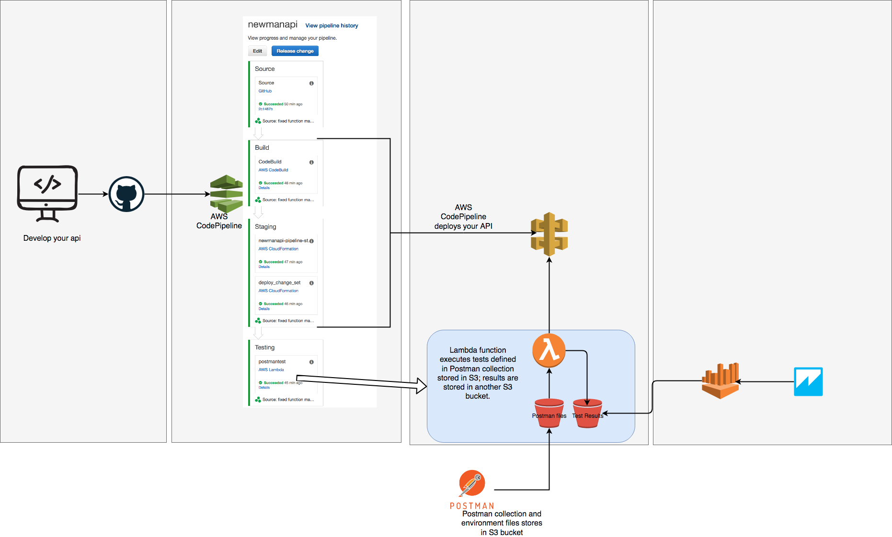

Unless you have been living under the proverbial rock, I am sure you are no stranger to 
the influence of API driven development. APIs are ubiquitous and have played a significant 
role in how we architect applications. I won't go into the virtues of API driven development 
and instead shift focus to the importance of testing your APIs not only for performance but 
also for functionality. More specifically, the importance of efficiently automating the 
testing and feedback process.

In this post, we will highlight how to automate the testing and reporting of results using 
Postman along with AWS services such as AWS Code Pipeline, Lambda, Amazon Athena, and Amazon 
Quicksight. 

Let's start with a simple API containing an endpoint that we need to make sure returns a 200 
response code along with specific content in the body and a particular header as part of that 
response. As a tester of that API, you would code your test logic in Postman and make a call 
to that API to have the response evaluated by the test script. 

In Postman one can write and run tests for each request using JavaScript. Here is what that 
looks like for our simple API.

SCREENSHOTS

        pm.test("Status code is 200", function () {
            pm.response.to.have.status(200);
        });
        
        var contentTypeHeaderExists = responseHeaders.hasOwnProperty("Content-Type");
        
        tests["Has Content-Type"] = contentTypeHeaderExists;
        
        pm.test("Body matches string", function () {
            pm.expect(pm.response.text()).to.include("v2.0");
        });

When we press Send, we ask Postman to send a request that particular endpoint. If we have 
test scripts in the Test section, we expect Postman to evaluate the response according to 
our script logic.  As stated earlier we are looking for three elements in the response: a 
specific header, a 200 response, and specific content in the body. If we get all elements 
back, we pass all three tests.

SCREENSHOT

Otherwise, we fail.

SCREENSHOT

Now, this is all fine and wonderful, but how can we include this testing as part of a 
Continuous Integration pipeline? 

Postman has a complementary project called Newman which is a command line Collection 
Runner that allows you to execute the same tests via the command line.  Moreover, Newman 
is built as a node js library enabling execution from within your node js code. We will 
take advantage of this feature to automate tests by wrapping our test execution in a 
Lambda function that runs our test suite inside code pipeline. 

Here is how that flow looks: write test scripts in Postman app client --> export test 
suite and store in S3 bucket --> execute code pipeline. Code pipeline has a stage that 
reads the Postman test suite files from S3 and runs your tests. All test results are 
saved in S3 bucket.

