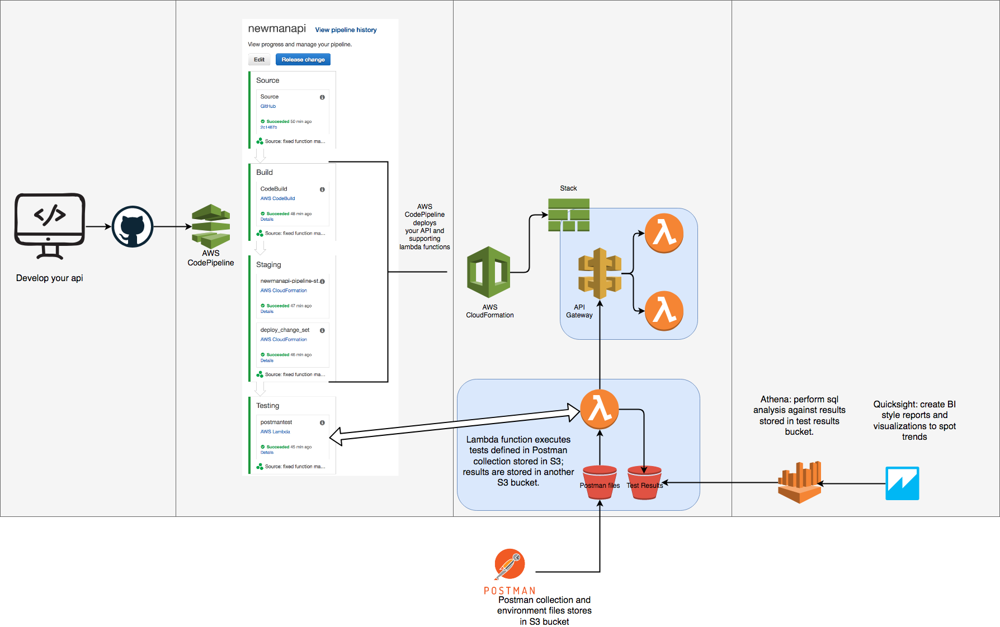
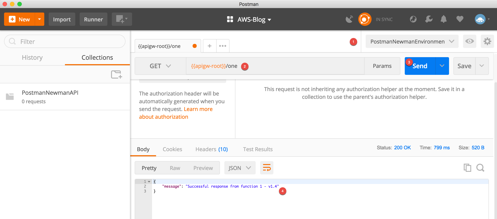

# About

This post demonstrates the use of code pipeline to build, deploy and functionally test an API. A stage within code pipeline executes a functional test suite created with Postman. Results are made available for analysis with Athena and Quicksight.



# 01 - API deployment

First, we deploy a straightforward API to test using Postman. The API has two endpoints backed by lambda to test simple get methods. This simple API should be enough to illustrate the concept and be the basis for your tests.

* First fork the existing GitHub repo into your account and check out the forked repo to your local dev environment. In your github repo, generate a new token (Settings -> Developer settings -> Personal Access Tokens). This will be used later in section 3.

* Create an S3 bucket to contain resources related to this project. I created a bucket called postman-newman as observed in subsequent instructions and screenshots. **You need to create your own and reference it appropriately. It is referred to as your bucket root.**

* Update "aws cloudformation package" command in buildspec.yml file found at 01api->buildspec.yml to reflect your bucket name.

* Using your command line navigate to the directory (01api) containing the source code for our API and yaml template used to package and deploy our API. 

* From there you execute the following commands to deploy the API. 
  * NOTE: remember to specify your region and S3 bucket.

  ```
  aws cloudformation package \
  --region us-east-1 \
  --template-file postman-newman-api.yaml \
  --s3-bucket <your_bucket_root> \
  --s3-prefix api-code \
  --output-template-file postman-newman-api-output.yaml
  ```

  Execute the following to deploy your api
  ```
  aws cloudformation deploy \
  --region us-east-1 \
  --template-file postman-newman-api-output.yaml \
  --stack-name postman-newman-api-stack \
  --capabilities CAPABILITY_IAM
  ```


  <details><summary>Screenshot: Cloud Formation Creation</summary><p>

  

  </p></details><p/>

* When your stack creation is complete you have an API to test.
* Take a look at the API Gateway and Lambda consoles to see what the cloud formation templates created.


# 02 - API testing with Postman client and CLI

In this section, we use the Postman client and the CLI to test our API and make sure it meets our functional requirements.

#### via the postman client

* Create a new collection in postman and name it PostmanNewmanAPI

    <details><summary>Screenshot: Postman Collection</summary><p>
    
    
    
    </p></details><p/>
    
    <details><summary>Screenshot: Postman Empty Collection</summary><p>
    
    
    
    </p></details><p/>


* Create an environment configuration called PostmanNewmanEnvironment 

    <details><summary>Screenshot: Postman Environment</summary><p>

    

    </p></details><p/>


  * Add your api gateway url. Key="apigw-root" Value = <api gateway root url from console\>


    <details><summary>Screenshot: Getting API Gateway URL</summary><p>

    

    </p></details><p/>


    <details><summary>Screenshot: Postman Environment Variables</summary><p>

    

    </p></details><p/>

* Create your API request to function one. 
  * Create a get request to function one using your environment variable, i.e., {{apigw-root}}/one
  * Make sure to select the created environment configuration (PostmanNewmanEnvironmnet) from the environment drop down - see screenshots.
  * You can execute this call now by pressing Send (blue button) and observe the response from API Gateway

    
      <details><summary>Screenshot: Single Get Request</summary><p>

      

      </p></details><p/>

    * in the "Body" pane you should have a response similar to:
        {
            "message": "Successful response from function 1 - v2.0"
        }
    * This response is coded in your lambda function. We use it to validate specific text in response body in future tests.
    * In the "Headers" pane you can see the headers returned by API Gateway.

  * Let's save this request as part of your collection.
    * Make sure to save the request as part of your "PostmanNewmanAPI" collection.

      <details><summary>Screenshot: Save Request</summary><p>

      

      </p></details><p/>

* add the following test script under the "Tests" pane in Postman
  * In this particular test we are looking for a 200 response, a Content-Type header and a specific string to in the response body. 

        pm.test("Status code is 200", function () {
            pm.response.to.have.status(200);
        });
        
        var contentTypeHeaderExists = responseHeaders.hasOwnProperty("Content-Type");
        
        tests["Has Content-Type"] = contentTypeHeaderExists;
        
        pm.test("Body matches string", function () {
            pm.expect(pm.response.text()).to.include("v2.0");
        });
  
  * When you execute the get request Postman tests the response to make sure it 
  contains the correct response code, header and body content as defined in our test script.

      <details><summary>Screenshot: Testing</summary><p>

      

      </p></details><p/>

  * Repeat these steps to make and save single get request to the second endpoint, i.e., {{apigw-root}}/two
  * Your Postman Collection should now be saved with 2 get requests for 2 endpoints.

      <details><summary>Screenshot: Postman Collection with 2 get requests</summary><p>

      

      </p></details><p/>

You now have an API with 2 endpoints and a way to test those endpoints for specific functional requirements using Postman. In the next section we will execute the same tests using the CLI.

#### via the newman cli

NOTE: please refer to the following for Newman installation instructions: 
https://www.getpostman.com/docs/v6/postman/collection_runs/command_line_integration_with_newman

* cd into the "02postman" directory.
* From the Postman client export both your postman collection and your postman environment into this directory (02postman) so you can run via CLI - see screenshots. 
  * NOTE: select "Collection v2.1 (recommended)" when prompted

    <details><summary>Screenshot: Export Collection</summary><p>

    

    </p></details><p/>

    <details><summary>Screenshot: Export Environment</summary><p>

    

    </p></details><p/>

  * You should now have 2 files in your 02postman directory: a postman collection file and a postman environment file.
  
    <details><summary>Screenshot: Postman Files</summary><p>

    

    </p></details><p/>

  * install the HTML reporter to be able to create HTML test result reports

    `npm install -g newman-reporter-html`

  * execute the following command
  
```
newman run PostmanNewmanAPI.postman_collection.json \
--environment PostmanNewmanEnvironment.postman_environment.json \
-r cli,json,html 
```
  * you should see a new directory "newman" containing both json and html reports with test results. 
  * Notice that results were also shown via the cli since we asked for cli output via "-r cli,json,html."

You should now have a pretty good sense of what you can do with Postman both manually via the Postman client and the command line using Newman. In the next section, we automate the deployment of our API and automate the execution of these tests using Code Pipeline.

# 03 - Automated API deployment and testing with AWS Code Pipeline

Here we show how to execute API gateway deployments using code pipeline. Our pipeline also includes a stage that executes the Postman tests that we created in section 2.

* go into cloud formation console and delete the stack you used to create the initial API deployment in section 01 - stack name should postman-newman-api-stack.

* cd into 03pipeline/lambda directory

Take a look at the code in newman-pipeline.js. This code represents the lambda function that executes newman to run tests defined in our exported postman collection and environment file. 

* Install required dependencies
  * In your cli execute the following: `npm install`

* lets zip this lambda function and store it in S3 to be used by the following cloud formation template that deploys this function as part of our pipeline that deploys our API and tests it using postman.
  * run `zip -r lambda-archive.zip ./*` inside of the lambda folder 
  * create a folder in your bucket root (S3 bucket created in step 1) named newman-lambda-runner. 
  * upload lambda-archive.zip to the folder you just created.

* Store your postman environment and collection files in S3.
  * Create a folder in your bucket root (S3 bucket created in step 1) named postman-env-files
  * Copy your postman environment and collection files into this bucket.

* Deploy and test your API with Code Pipeline.
  - enter cloudformation console and deploy cfn/postman-pipeline.yaml. Provide your github access token, obtained in section 1.
    + make sure to enter the bucket root you have been using to store your lambda code, postman files, and related files.

* View test results
  - When the cloud formation template used to deploy your pipeline finishes, you can navigate to the Code Pipeline console to view your pipeline. 
  - This pipeline deploys the same API you deployed in step 1.
  - Your test results should be in your bucket root test results folder.
    + e.g. <bucket_root>/<file_name>.json where file_name is a timestamped file e.g. 20180825_154040.json


TODO: screenshots

# 04 - Using Athena to query test results

In this section, we will create an external table in Athena that will point to the test results folder generated in the above sections. The Athena table can be created using the query defined in 04athena/test_results_athena_table.sql. Ensure that you update following properties in the query with appropriate names.

NAME_OF_ATHENA_DB, NAME_OF_ATHENA_TABLE, S3_BUCKET_NAME, TEST_RESULTS_PATH

Once the table is created in Athena, you can run various ad-hoc queries against this table to gather meaningful data from various test results. We have provided few sample queries below:

1.  Query to get test results data between specific date range
<p>
SELECT api_id,report_date,report_time, tests_total, tests_pending, tests_failed, testscripts_total, testscripts_pending, testscripts_failed
FROM <ATHENA_TABLE_NAME>
where date(report_date) BETWEEN date('2018-01-01') AND date('2018-08-01')
</p>
 
2. Query to get test results data  for date range which is more than three months old and less than six months old than the current date.
 <p>
SELECT api_id,report_date,report_time, tests_total, tests_pending, tests_failed, testscripts_total, testscripts_pending, testscripts_failed
FROM <ATHENA_TABLE_NAME>
where (date(report_date) < (current_date - interval '3' month)) AND (date(report_date) > (current_date - interval '6' month))
</p>
 
3. Query to get test results data for a specific API using API ID.
<p>
SELECT api_id,report_date,report_time, tests_total, tests_pending, tests_failed, testscripts_total, testscripts_pending, testscripts_failed
FROM <ATHENA_TABLE_NAME>
where api_id = 'https://<API_ID>.execute-api.us-east-1.amazonaws.com/Prod/'
</p>
 
4. Query to get test result data for failed tests
<p>
SELECT api_id,report_date,report_time, tests_total, tests_pending, tests_failed, testscripts_total, testscripts_pending, testscripts_failed
FROM <ATHENA_TABLE_NAME>
where cast(testscripts_failed AS INTEGER) > 0
</p>
   
# 05 Using quick sight to visualize test results.

In this section, we will walk you over the steps required to configure Amazon QuickSight to create visual insights into the test results. Let's start with configuring Amazon QuickSight.

* In QuickSight console, create a new data set using Athena data source. 
* Provide data source name as  "postman_newman_quicksight_data_set".
* Validate connection and then click "Create data source".
* In QuickSight console, create a new data analysis.
* Select "postman_newman_quicksight_data_set" create above and then click "Create analysis".

Next, we will cover how we create few sample visuals.

<p>
 1. For creating visual that shows how many APIs were test in a given year
  <p>
    * Select "Pie Chart" visual type
    * Put api_id(Count) in Value field and report_date(YEAR) in Group/Color field
  </p>
</p>
<p>
 2. For creating visual that shows number of test scripts per year
  <p>
    * Select "Pie Chart" visual type
    * Put transcripts_failed(Average) in Value field and report_date(YEAR) in Group/Color field
  </p>
</p>
<p>
 3. For creating visual that shows shows side-by-side analysis of Total Assertions vs Failed Assertions, every quarter:
  <p>
    * Select "Clustered Bar Combo Chart" visual type
    * Put report_date(QUARTER) in X axis field, assertions_total(SUM) and assertions_failed(Sum) in Bars field.
  </p>
</p>

# 06 Creating single page app to list reports


# References

[Newman on Github](https://github.com/postmanlabs/newman)

[Postman CLI Integration w/ Newman](https://www.getpostman.com/docs/postman/collection_runs/command_line_integration_with_newman)

[AWS Lambda Sample for AWS CodeBuild](https://docs.aws.amazon.com/codebuild/latest/userguide/sample-lambda.html)

[Building a Pipeline for Your Serverless Application](https://docs.aws.amazon.com/lambda/latest/dg/build-pipeline.html)

[Deploying Lambda-based Applications](https://docs.aws.amazon.com/lambda/latest/dg/deploying-lambda-apps.html)

[Automating Deployment of Lambda-based Applications](https://docs.aws.amazon.com/lambda/latest/dg/automating-deployment.html)

[Lambda in Pipeline](https://docs.aws.amazon.com/codepipeline/latest/userguide/actions-invoke-lambda-function.html)

[Athena and JSON](https://aws.amazon.com/blogs/big-data/create-tables-in-amazon-athena-from-nested-json-and-mappings-using-jsonserde/)

[Quick Sight & JSON](https://docs.aws.amazon.com/quicksight/latest/user/supported-data-sources.html#json-data-sources)

[Serverless UI Testing](https://github.com/awslabs/serverless-automated-ui-testing)

[Serverless Performance Testing](https://aws.amazon.com/blogs/apn/performance-testing-in-continuous-delivery-using-aws-codepipeline-and-blazemeter/)
