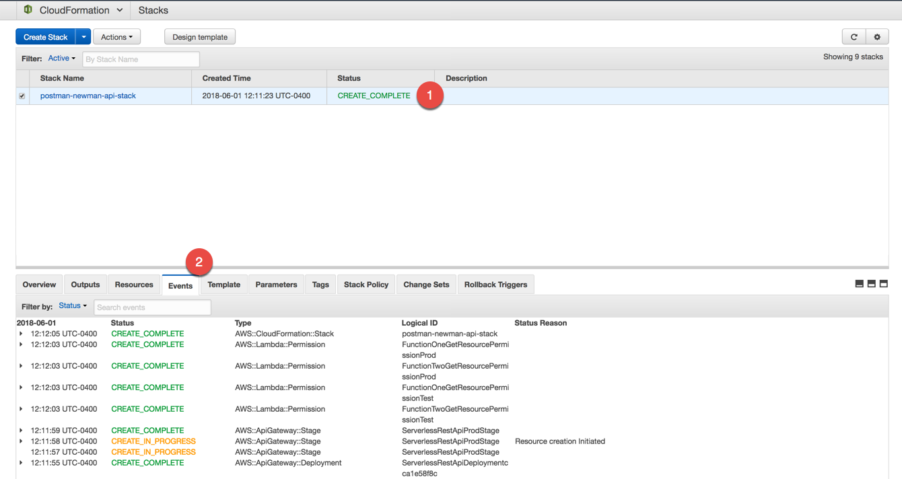
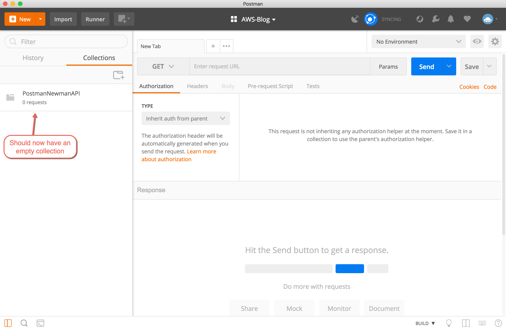
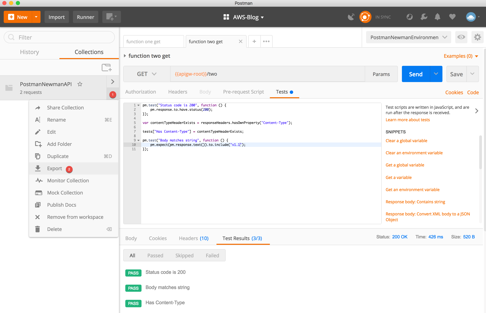

# About

This post will demonstrate use of code pipeline to build, deploy and functionally test an API. A stage within code pipeline will execute a functional test suite created with Postman. Results are made available for analysis with Athena and Quicksight


# 01 - API deployment

First we will deploy a very simple api to test using Postman. 

* Using our command line navigate to directory (01api) containing the source code for our api and yaml template used to package and deploy our api. 
* From there you will execute the following commands to deploy the api. 
  * NOTE: please specify your own region, s3 bucket and s3 bucket prefix.


```
aws cloudformation package \
--region us-east-1 \
--template-file postman-newman-api.yaml \
--s3-bucket postman-newman \
--s3-prefix api-code \
--output-template-file postman-newman-api-output.yaml
```

Execute the following to deploy your api
```
aws cloudformation deploy \
--region us-east-1 \
--template-file postman-newman-api-output.yaml \
--stack-name postman-newman-api-stack \
--capabilities CAPABILITY_IAM
```


<details><summary>Screenshot: Cloud Formation Creation</summary><p>



</p></details><p/>

# 02 - API testing with Postman client and cli

#### via the postman client

* create a new collection in postman and name it PostmanNewmanAPI

    <details><summary>Screenshot: Postman Collection</summary><p>

    

    </p></details><p/>


    <details><summary>Screenshot: Postman Empty Collection</summary><p>

    

    </p></details><p/>

* create an environment configuration called PostmanNewmanEnvironment 

    <details><summary>Screenshot: Postman Environment</summary><p>

    

    </p></details><p/>


  * add your api gateway url. Key="apigw-root" Value = <api gateway root url from console\>

    <details><summary>Screenshot: Environment Variables</summary><p>

    

    </p></details><p/>


* create your api request to function one. 
  * using your environment configuration you should define your request as a get request to 
  {{apigw-root}}/one
  * You can execute this call now and observe the response from API Gateway
    * in the "Body" pane you should have a response as follows:
        {
            "message": "Successful response from function 2 - v1.0"
        }
    * In the "Headers" pane you can see the headers returned by API Gateway.
    
      <details><summary>Screenshot: Single Get Request</summary><p>

      

      </p></details><p/>
  * Lets save this request as part of your collection.

      <details><summary>Screenshot: Save Request</summary><p>

      

      </p></details><p/>
  * Repeat these steps make and save single get request to the second endpoint, i.e. {{apigw-root}}/two
  * Your Postman Collection should now be saved with 2 get requests for 2 endpoints.


      <details><summary>Screenshot: Postman Collection with 2 get requests</summary><p>

      

      </p></details><p/>

* add the following test script under the "Tests" pane 
  * In this particular test we are looking for a 200 response, a Content-Type header 
  and a specific string to be included in the response body. 

        pm.test("Status code is 200", function () {
            pm.response.to.have.status(200);
        });
        
        var contentTypeHeaderExists = responseHeaders.hasOwnProperty("Content-Type");
        
        tests["Has Content-Type"] = contentTypeHeaderExists;
        
        pm.test("Body matches string", function () {
            pm.expect(pm.response.text()).to.include("v1.0");
        });
  
  * When you execute the get request Postman will now test the response to make sure it 
  contains the correct response code, header and body content as defined in our test script.

      <details><summary>Screenshot: Testing</summary><p>

      

      </p></details><p/>

That was a simple test illustrating how to use postman to manually validate API response 
requirements. We will now move on to execute via cli.

#### via the newman cli

NOTE: please refer to the following for newman installation instructions: 
https://www.getpostman.com/docs/v6/postman/collection_runs/command_line_integration_with_newman

* cd into the "02postman" directory.
* export both your postman collection and your postman environment into this directory (02postman) so you can run via cli. 
  * NOTE: select "Collection v2.1 (recommended)" when prompted

    <details><summary>Screenshot: Export Collection</summary><p>

    

    </p></details><p/>

    <details><summary>Screenshot: Export Environment</summary><p>

    

    </p></details><p/>

  * You should now have 2 files in your 02postman directory: a postman collection file and a postman environment file.
  
    <details><summary>Screenshot: Postman Files</summary><p>

    

    </p></details><p/>

  * execute the following command
  
```
newman run PostmanNewmanAPI.postman_collection.json \
--environment PostmanNewmanEnvironment.postman_environment.json \
-r cli,json,html 
```
  * you should see a new directory "newman" containing both json and html reports with test results. 
  * Notice that results where also shown via the cli since we asked for cli output via "-r cli,json,html"

You should now have a pretty good sense of what you can do with postman both manually via the client and via the command line. Later on we will also execute these tests programmatically allowing us to automate test execution via code pipeline

# 03 - automated api deployment with code pipeline

On to our next baby step before automating postman in code pipeline. Here
we will show how to execute api gateway deployments using code pipeline.

* go into cloud formation and delete the stack you used to create the initial API Gateway deployment.

* go into AWS Console --> Services --> Code Pipeline and click "Get Started"

* Create pipeline: pipeline name

    <details><summary>Screenshot: Create Pipeline step 1</summary><p>

    

    </p></details><p/>

* Create pipeline: select source repo.
  * For our source repo we will point to our github repository. You will be prompted to connect to your github account and select your repo.

    <details><summary>Screenshot: Create Pipeline step 2 - select source repo</summary><p>

    

    </p></details><p/>

* Create pipeline: create build project.

    <details><summary>Screenshot: Create Pipeline step 3 - build project</summary><p>

    

    </p></details><p/>

*Continue here with screen shots*


* At this point you should have an API that is automatically deployed anytime you commit a change to your project.
* You can now grab the new API endpoint form the AWS API Gateway console and update your postman enviornment file to this new endpoint.
  * Make sure you save your new environment file.
* You can now test your updated api via postman client and cli as we did earlier.

TODO: Apply granular permissions according to least priv.


# 04 - add automated postman collection testing to pipeline

This section demonstrates how to add lambda function to run postman collections
via code pipeline stage. This is the lambda function responsible for executing a postman collection.

NOTE: This lambda function needs permissions to
- allow read access to S3 bucket to get postman collection and environment files
- allow write access to S3 bucket in order to store test results
- allow access to code pipeline so it can acknowledge successful execution to code pipeline

The function 
- grabs the postman collection and environment file from an S3 bucket
- runs the test and places results first in lambda's /tmp folder
- publishes cleansed results to s3 bucket
- send confirmation to code pipeline

* cd into 03codepipeline/lambda folder
* put your postman collection and environment json files in a bucket of your choosing. In my case I will add it to same bucket (postman-newman) I used to package my api lamabda functions. I will place these files in a postman-env-files subfolder. You will need to update our runner test function with these values.

* Update the lambda function code (newman-pipeline.js) pointing to the bucket and key of your postman collection and environment file. You are looking for this code to update with your specific bucket and key.
    
```
let params = {
    Bucket: 'postman-newman',
    Key: 'postman-env-files/PostmanNewmanAPI.postman_collection.json'
};

let params = {
    Bucket: 'postman-newman',
    Key: 'postman-env-files/PostmanNewmanEnvironment.postman_environment.json'
};
```

TODO: replace this with environment variables and instructions to update env variables.

* execute the following command to build and package this lambda function
```
aws cloudformation package \
--region us-east-1 \
--template-file newman-lambda-runner.yaml \
--s3-bucket postman-newman \
--s3-prefix newman-lambda-runner \
--output-template-file newman-lambda-runner-output.yaml
```

* execute the following to deploy the function
```
aws cloudformation deploy \
--region us-east-1 \
--template-file newman-lambda-runner-output.yaml \
--stack-name newman-lambda-function \
--capabilities CAPABILITY_IAM
```

* you can now add this function as a stage in code pipe line.

TODO: edit pipeline instructions and screen shots
 

* execute your pipeline now and when complete you will 


TODO: Apply granular permissions according to least priv access.
TODO: normalize/cleanse output to make it easier to read with athena
TODO  more api endpoints, e.g. secured via cognito user pool, secured via sigv4, custom transformation, oauth, etc.

# 05 - Using athena to query test results

create the athena table pointing to test results bucket - see athena.sql


# 06 TODO: Using quick sight to visualize test results.


#### reference
- [Athena and JSON](https://aws.amazon.com/blogs/big-data/create-tables-in-amazon-athena-from-nested-json-and-mappings-using-jsonserde/)
- [Quick Sight & JSON](https://docs.aws.amazon.com/quicksight/latest/user/supported-data-sources.html#json-data-sources)

# 07 TODO: single page app to list reports


# References

[Newman on Github](https://github.com/postmanlabs/newman)

[Postman CLI Integration w/ Newman](https://www.getpostman.com/docs/postman/collection_runs/command_line_integration_with_newman)

[AWS Lambda Sample for AWS CodeBuild](https://docs.aws.amazon.com/codebuild/latest/userguide/sample-lambda.html)

[Building a Pipeline for Your Serverless Application](https://docs.aws.amazon.com/lambda/latest/dg/build-pipeline.html)

[Deploying Lambda-based Applications](https://docs.aws.amazon.com/lambda/latest/dg/deploying-lambda-apps.html)

[Automating Deployment of Lambda-based Applications](https://docs.aws.amazon.com/lambda/latest/dg/automating-deployment.html)

[Lambda in Pipeline](https://docs.aws.amazon.com/codepipeline/latest/userguide/actions-invoke-lambda-function.html)
